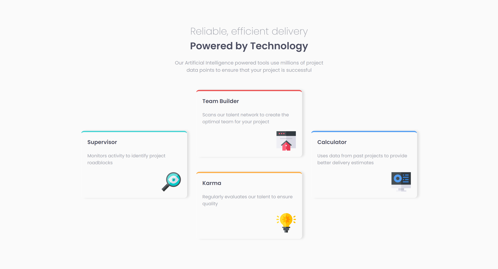

# Frontend Mentor - Four Card Feature Section solution

This is a solution to the [Four card feature section challenge on Frontend Mentor](https://www.frontendmentor.io/challenges/four-card-feature-section-weK1eFYK). Frontend Mentor challenges help you improve your coding skills by building realistic projects. 

## Table of contents

- [Frontend Mentor - Four Card Feature Section solution](#frontend-mentor---four-card-feature-section-master-solution)
  - [Table of contents](#table-of-contents)
  - [Overview](#overview)
    - [Screenshot](#screenshot)
    - [Links](#links)
  - [My process](#my-process)
    - [Built with](#built-with)
  - [Author](#author)

## Overview

### Screenshot

### Links

- Solution URL: [https://github.com/nvshanmukh/four-card-feature-section](https://github.com/nvshanmukh/four-card-feature-section)
- Live Site URL: [https://nvshanmukh.github.io/four-card-feature-section/](https://nvshanmukh.github.io/four-card-feature-section/)

## My process

### Built with

- Semantic HTML5 markup
- Flexbox

## Author

- Frontend Mentor - [@nvshanmukh](https://www.frontendmentor.io/profile/nvshanmukh)
